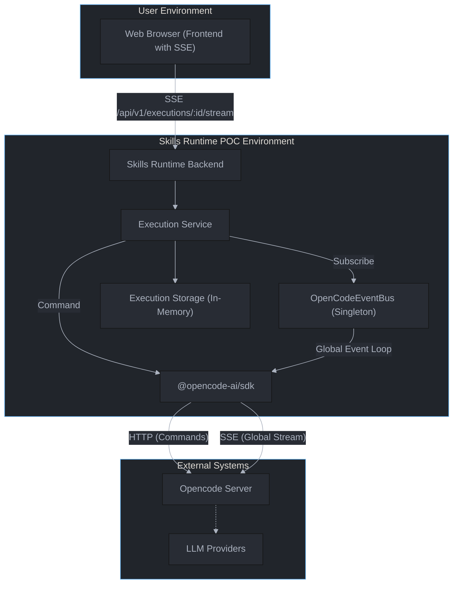
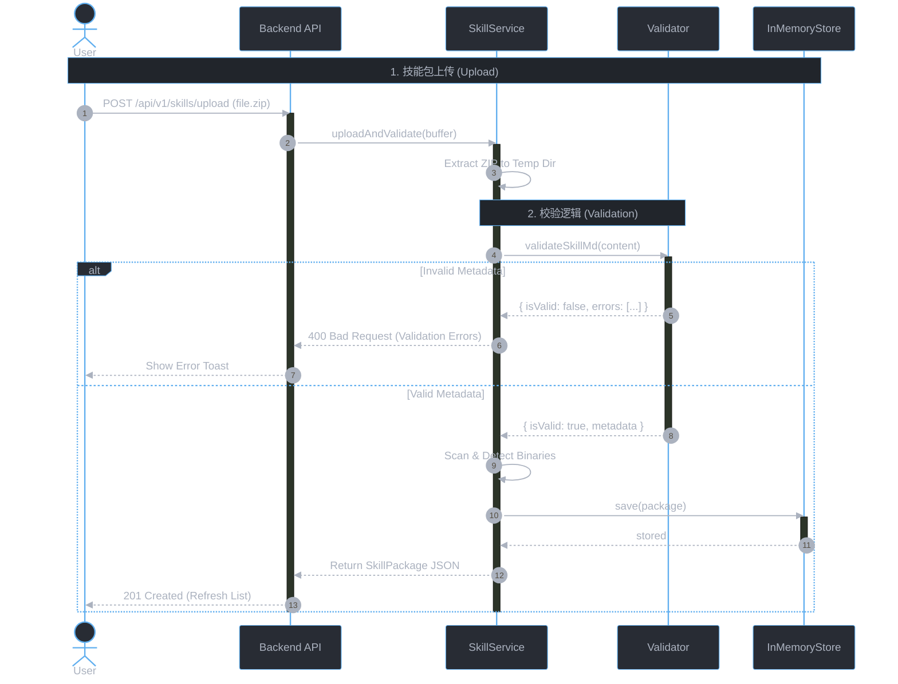

# ultrathink: 项目架构分析与现状 (Updated)

本文档描述 `claude-skills-runtime-poc` 项目的实际架构情况。本文档已于 2026/01/19 更新，以反映后端重构后的状态。

## 1. 现状分析 (Current Implementation)

经过最近的重构，项目已对齐 `Opencode` 标准架构：

| 特性 | 参考文档 (Opencode Standard) | 当前实现 (claude-skills-runtime-poc) | 状态 |
| :--- | :--- | :--- | :--- |
| **SDK 使用** | 使用 `@opencode-ai/sdk` | **已集成**。后端使用 `@opencode-ai/sdk/v2/client`，通过 `services/opencode.client.ts` 导出单一实例。 | ✅ 已完成 |
| **通信协议** | 使用 HTTP + **SSE** | **支持 SSE**。后端通过 SDK 的 `client.global.event()` 监听 `tool.start`, `tool.end`, `message.part.updated` 等事件。 | ✅ 已完成 |
| **API 端点** | 标准 SDK 方法 | 使用 SDK 封装方法 (`session.create`, `session.prompt`)，内部自动处理正确的 API 路径和类型。 | ✅ 已完成 |
| **交互模式** | 客户端/服务器分离 | 后端 (`packages/backend`) 作为 BFF 层，代理前端请求并通过 SDK 与 Opencode Server 通信。 | ⚠️ BFF 模式 |

### 1.1 架构差异分析 (Architecture Gap Analysis)

对比标准实现 (`opencode/packages/app` Case A) 与当前实现，主要差异在于流式连接的管理方式：

| 维度 | 标准架构 (Opencode Case A) | 当前实现 (claude-skills-runtime-poc) | 影响评估 |
| :--- | :--- | :--- | :--- |
| **流式连接** | **单连接/用户** (Per User/Client) | **多连接/请求** (Per Request) | 🚩 **高风险** |
| **SDK 接口** | `client.event.subscribe()` | `client.global.event()` | 语义一致，API路径不同 |
| **事件处理** | 自动过滤，UI 直接消费 | 后端收到全量事件后手动过滤 | 带宽浪费，CPU 浪费 |
| **扩展性** | 高 (依赖 SSE 天然并发) | 低 (受限于后端与 Server 间的连接数) | 潜在的 DDoS 风险 |

**主要风险 (Connection Storm)**:
当前 `ExecutionService` 为每个技能执行请求都建立一个新的 SSE 连接 (`global.event()`)。在高并发场景下，这将导致后端与 OpenCode Server 之间建立大量冗余的长连接，可能触发端口耗尽或服务器负载过高。

**建议方案**:
重构为**单例监听 + 分发模式**。后端维护单一的 SDK 事件流连接，通过内部 EventBus (`EventEmitter`) 根据 SessionID 将事件分发给具体的 HTTP/SSE 响应流。

## 2. 系统上下文 (System Context)

系统采用典型的 Backend-for-Frontend (BFF) 架构：

## 3. 核心业务场景：技能生命周期管理 (Skill Lifecycle Management)

技能的“上线”过程独立于执行过程。包括上传、解压、校验和存储。

### 3.1 上传与校验 (Upload & Validation)

验证逻辑确保只有合法的 ZIP 包才能被后续执行：
1. **格式校验**: 必须是合法的 ZIP 文件。
2. **结构校验**: 解压后必须包含 `SKILL.md`。
3. **元数据校验**: `SKILL.md` 必须包含合法的 YAML Frontmatter (name, description)。
4. **安全校验**: 检测并拒绝二进制文件（除允许的资源外），防止恶意代码隐藏。

### 时序图 (Sequence Diagram: Management)

## 4. 核心业务场景：技能执行 (Skill Execution)

重构后，技能执行流程支持全链路流式传输，利用 **EventBus** 实现连接复用：

### 时序图 (Sequence Diagram)

```mermaid
%%{init: {'theme': 'base', 'themeVariables': { 'primaryColor': '#282c34', 'edgeLabelBackground':'#282c34', 'mainBkg': '#282c34', 'primaryTextColor': '#abb2bf', 'lineColor': '#abb2bf', 'tertiaryColor': '#21252b', 'clusterBkg': '#21252b', 'clusterBorder': '#61afef', 'fontFamily': 'arial', 'actorBkg': '#282c34', 'actorBorder': '#61afef', 'actorTextColor': '#abb2bf', 'signalColor': '#abb2bf', 'signalTextColor': '#abb2bf', 'noteBkgColor': '#21252b', 'noteTextColor': '#abb2bf', 'noteBorderColor': '#61afef'}}}%%
sequenceDiagram
    autonumber
    actor User

    box "User Environment (Browser)" #21252b
        participant FE as Frontend
    end

    box "System Context (Skills Runtime Backend)" #282c34
        participant ES as ExecutionService
        participant Bus as OpenCodeEventBus
        participant SDK as Opencode SDK
    end

    participant Server as Opencode Server (Remote)

    Note over Server: Pre-condition: Opencode Server running externally
    Note over Bus, Server: Pre-condition: Bus has established global SSE connection

    %% 1. Start Execution & Session Setup
    Note over User, Server: 1. 发起执行与会话创建 (Start & Session)
    User->>FE: 点击 "Run Skill"
    FE->>ES: POST /executions { prompt }
    
    activate ES
    
    rect rgb(33, 37, 43)
        Note right of ES: 创建会话 (Create Session)
        ES->>SDK: session.create()
        SDK->>Server: POST /session
        Server-->>SDK: { id: "sess_123" }
    end
    
    Note right of ES: 注册监听 (Subscribe)
    ES->>Bus: subscribe("sess_123")
    activate Bus
    Bus-->>ES: listeners attached
    
    ES-->>FE: Return { id: "exec_1", status: 'running' }
    deactivate ES
    
    %% 2. Streaming & Processing
    Note over User, Server: 2. 流式处理 (Streaming)
    
    FE->>ES: GET /executions/exec_1/stream (SSE)
    activate FE
    
    par Background Process
        ES->>SDK: session.prompt(prompt)
        activate Server
        
        loop Event Distribution
            Server-->>SDK: SSE Event (tool/message)
            SDK-->>Bus: Global Event Stream
            Bus-->>ES: Dispatch to "sess_123" Listener
            ES-->>FE: SSE Data (User Stream)
        end
        
        Server-->>SDK: Response (Done)
        deactivate Server
    and Frontend Display
        FE->>User: 实时显示日志与结果
    end
    
    ES->>Bus: unsubscribe("sess_123")
    deactivate Bus
    
    ES->>ES: Update Status -> Completed
    ES-->>FE: SSE Event (complete)
    deactivate FE
```

## 5. 已完成改进 (Completed Improvements)

以下建议已并在代码库中实施：

1.  **引入官方 SDK**: 已移除自定义 `OpenCodeClient`，完全迁移至 `@opencode-ai/sdk`。
2.  **实现流式响应**:
    *   **后端**: `ExecutionService` 使用后台事件循环处理 SDK 事件。
    *   **前端**: `useExecutionLogs` 钩子已更新为使用 `EventSource` 消费后端 SSE 端点。

## 6. 后续规划 (Future Roadmap)

1.  **集成测试**: 在真实 Opencode Server 环境中验证端到端流程。
2.  **错误处理增强**: 完善 SDK 连接断开、超时的恢复机制。
3.  **UI 优化**: 进一步优化前端日志展示，支持 Markdown 渲染流式内容。
